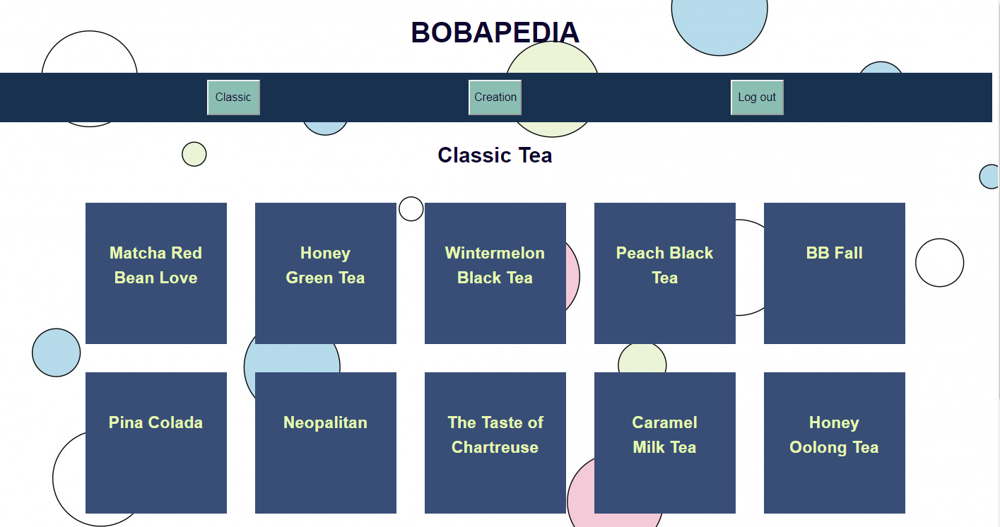
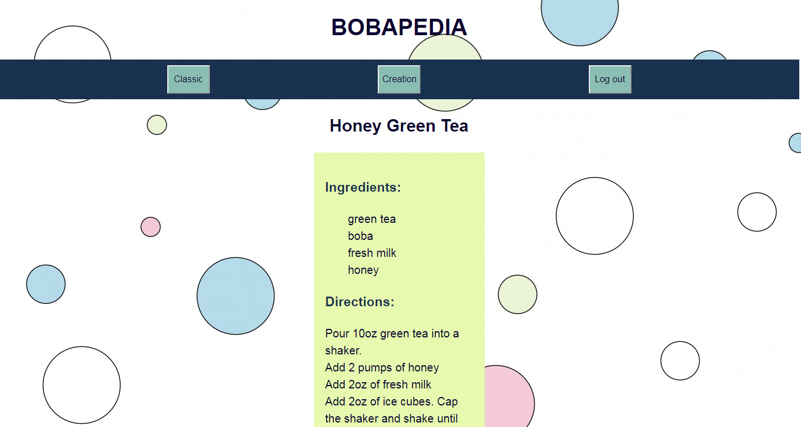

# Bobapedia Client

## Live App
[Bobapedia](https://build-theta-ecru.now.sh/)

## API Documentation

**Authentication**
  The endpoints related to creation tea are protected while the ones for classic, login, and registration are not. Simply register and login and you will have the authentication to access creation tea.

**Endpoints**\
  */registration*\
  - Accepts a json object of username and password and adds it into the user database\
  */login*\
  - Accepts a json object of username and password\
  - Responds with an auth token for the user's current logged in session\
  */classic*\
  - get. Responds with an array of the "top" 15 tea objects with their fields\
  */classic/:classicID*\
  - get. Responds with one specific classicc tea object with its corresponding fields\
  */creation*\
  - get. Responds with an array of all user created tea objects and its fields. Authentication required\
  - post. Accepts a json tea object with every field name required. Null values okay. Adds the tea object into the creation tea database. Authentication required. Responds with 201 if successful\
  */creation/:creationID*\
  - get. Responds with one specific creation tea object with its corresponding fields. Authentication required\
  - delete. Responds with 204 if successful. Authentication required\
  - patch. Accepts a json tea object with every updated field required. Authentication required. Responds with 204 if successful\

## Screenshots
  The classic tea page where the "top" 15 teas are displayed
	
  After clicking on a tea, this recipe card will show with the correct fields to make that tea
  

## Summary

Bobapedia is a collection of bubble (or boba) tea recipes. The Classic page is where you'll find the "top" 15 bubble teas. Clicking on one will direct you to the recipe to make that tea. The Creation page is where you can make your own tea recipe as well as view other teas made by other users. You can also update or delete the teas you have made. However, you must have an account to view or use this page. Please use the register tab to make an account or login if you've already made one.

## Technology used

Javascript, HTML, React

## Current known bugs
**Client and server testing:**\
  I have about half the tests working. The other half, I have no idea why they don't work. I thought I implemented the test cases correctly from the curriculum but that doesn't seem to be the case.\
**Client and server script commands:**\
  `npm run deploy` command for both client and server don't exactly work as expected. Neither does `npm run migrate` for server side. I manually ran the commands for deployment when I couldn't get them to work. I prioritized working on the bulk of the app instead of spending time to get these commands to work and I forgot to work on them again before the time of submission.\
**Update Tea Page:**\
  When you go to update the tea creations, the default values will not populate the form even though I used `defaultValue` within the form. However, it will still work as expected. A possible solution would be to use `value` and `onchange` instead and refactor the context to continuously set the correct values for the updated tea. Like earlier, I prioritized more pressing matters as time was running out.\

# This project was bootstrapped with [Create React App](https://github.com/facebook/create-react-app).

## Available Scripts

In the project directory, you can run:

### `npm start`

Runs the app in the development mode. 
Open [http://localhost:3000](http://localhost:3000) to view it in the browser.

The page will reload if you make edits. 
You will also see any lint errors in the console.

### `npm test`

Launches the test runner in the interactive watch mode. 
See the section about [running tests](https://facebook.github.io/create-react-app/docs/running-tests) for more information.

### `npm run build`

Builds the app for production to the `build` folder. 
It correctly bundles React in production mode and optimizes the build for the best performance.

The build is minified and the filenames include the hashes. 
Your app is ready to be deployed!

See the section about [deployment](https://facebook.github.io/create-react-app/docs/deployment) for more information.
